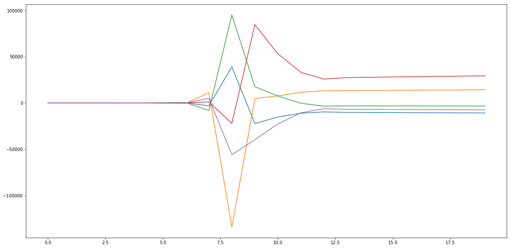

#### Importing Required Libraries


```python
import numpy as np
import matplotlib.pyplot as plt
```

> Defining Function to get F and Z per iteration based on X.


```python
def get_F(x):
    f = [0]*5
    f[0] = x[0]+x[1]+x[2]-13.5
    f[1] = 2*x[3]+4*x[0]+2*x[4]-227
    f[2] = x[4]+x[1]+2*x[2]-86.5
    f[3] = x[2]*x[3]/(x[1]*x[4])-0.929
    f[4] = ((12.2/100)**2)*x[1]*(x[4]**3)/(x[0]*x[4])-126.8

    return f
```


```python
def get_Z(x):
    z = [[1, 1, 1, 0, 0],
         [4, 0, 0, 2, 2],
         [0, 1, 2, 0, 1],
         [0,
          -(x[2]*x[3]/(x[1]**2*x[4])), 
          x[3]/(x[1]*x[4]),
          x[2]/(x[1]*x[4]),
          -(x[2]*x[3]/(x[1]*x[4]**2))],
         [-(x[1]*x[3]**3/(x[0]*x[4]**2)*0.014884),
          x[3]**3/(x[0]*x[4])*0.014884,
          0,
          3*0.014884*x[1]*x[3]**2/(x[0]*x[4]),
          -(x[1]*x[3]**3/(x[0]*x[4]**2)*0.014884)]]
    
    return z
```

Initialize *X_0* as [29, 29, 29, 29, 29]() for initial step. Running the loop for 20 iterations based on the system of non-linear equations obtained. Plot shows convergence of each variable over 20 iterations.


```python
x = [29]*5
f = get_F(x)
z = get_Z(x)
c = []
iter = []

for i in range(20):
    
    z_inv = np.linalg.inv(z)
    iter.append(i)
    
    print("iter", i+1, "\n======== \n")
    print("X\n", x, "\n\n")
    print("Z\n", z, "\n\n")
    print("Z_inv\n", z_inv, "\n\n")
    print("F\n", f, "\n\n")
    print("========================================================\n\n")

    x_ = np.matmul(z_inv, ( np.negative(f) + np.matmul(z, x)))
    x = x_
    f = get_F(x_)
    z = get_Z(x_)
    c.append(x_)
    
print(len(iter), len(c[0]))
plt.figure(figsize=(20,10))
plt.plot(iter, [i[0] for i in c], [i[1] for i in c])
plt.plot(iter, [i[2] for i in c], [i[3] for i in c])
plt.plot(iter, [i[4] for i in c])
plt.show()
```

    iter 1 
    ======== 
    
    X
     [29, 29, 29, 29, 29] 
    
    
    Z
     [[1, 1, 1, 0, 0], [4, 0, 0, 2, 2], [0, 1, 2, 0, 1], [0, -0.034482758620689655, 0.034482758620689655, 0.034482758620689655, -0.034482758620689655], [-0.43163599999999996, 0.43163599999999996, 0, 1.2949080000000002, -0.43163599999999996]] 
    
    
    Z_inv
     [[  0.43589744   0.11538462  -0.25641026   2.23076923  -0.23761712]
     [  0.48717949  -0.07692308  -0.05128205 -11.15384615   0.41582996]
     [  0.07692308  -0.03846154   0.30769231   8.92307692  -0.17821284]
     [ -0.23076923   0.11538462   0.07692308   2.23076923   0.53463852]
     [ -0.64102564   0.15384615   0.43589744  -6.69230769  -0.05940428]] 
    
    
    F
     [73.5, 5, 29.5, 0.07099999999999995, -114.282556] 
    
    
    ========================================================
    
    
    iter 2 
    ======== 
    
    X
     [-23.36515832  43.40377706  -6.53861874 104.05685622  56.17346042] 
    
    
    Z
     [[1, 1, 1, 0, 0], [4, 0, 0, 2, 2], [0, 1, 2, 0, 1], [0, 0.006429400640308589, 0.04267878020380158, -0.0026818057180822944, 0.004967831248477901], [9.872524112543632, -12.777087158525763, 0, -15.988581511320598, 9.872524112543632]] 
    
    
    Z_inv
     [[ 4.69418913e-01  1.03086783e-01 -3.51625750e-01  5.47889572e+00
       1.19760613e-02]
     [ 5.95978400e-01 -1.26240669e-01  5.38151434e-01 -3.91829678e+01
      -9.21909368e-03]
     [-6.53973136e-02  2.31538857e-02 -1.86525684e-01  3.37040720e+01
      -2.75696763e-03]
     [-4.73654053e-01  2.13893536e-01 -1.31648435e-01  1.72673849e+01
      -3.86851516e-02]
     [-4.65183773e-01  7.99328974e-02  8.34899935e-01 -2.82251763e+01
       1.47330289e-02]] 
    
    
    F
     [-3.552713678800501e-15, 2.842170943040401e-14, -1.4210854715202004e-14, -1.208060272010782, -214.04505362277234] 
    
    
    ========================================================
    
    
    iter 3 
    ======== 
    
    X
     [-14.18290538  -5.90491103  33.58781641 116.63653254  25.22927821] 
    
    
    Z
     [[1, 1, 1, 0, 0], [4, 0, 0, 2, 2], [0, 1, 2, 0, 1], [0, -4.453329485283424, -0.7829182485093283, -0.22545692862788178, 1.0423014947360267], [-15.447633700614702, -66.00144294547705, 0, 10.024285870158511, -15.447633700614702]] 
    
    
    Z_inv
     [[ 0.7709753   0.04046133 -0.32067435  0.16556851 -0.00434885]
     [-0.17162702  0.01655853  0.02456656 -0.15645811 -0.00682259]
     [ 0.40065171 -0.05701985  0.29610779 -0.0091104   0.01117144]
     [-0.9122742   0.32159617  0.25813084 -0.50581593  0.02421798]
     [-0.62967641  0.09748118  0.38321786  0.17467891 -0.01552029]] 
    
    
    F
     [-2.842170943040401e-14, 8.526512829121202e-14, 0.0, -27.225514393145477, -122.85563164333497] 
    
    
    ========================================================
    
    
    iter 4 
    ======== 
    
    X
     [-10.20949788 -11.00275744  34.71225532 105.84074898  28.07824679] 
    
    
    Z
     [[1, 1, 1, 0, 0], [4, 0, 0, 2, 2], [0, 1, 2, 0, 1], [0, -1.0808431424516238, -0.3425952826825176, -0.11235989011572428, 0.4235397962000337], [-24.123235472604136, -61.560764462368745, 0, 19.198791551035793, -24.123235472604136]] 
    
    
    Z_inv
     [[ 8.20779094e-01  3.87669564e-02 -3.21491277e-01  5.18969611e-01
      -1.00123720e-03]
     [-3.41212838e-01  3.63904089e-02  4.41748188e-02 -7.38081384e-01
      -8.11048760e-03]
     [ 5.20433744e-01 -7.51573652e-02  2.77316458e-01  2.19111773e-01
       9.11172481e-03]
     [-9.41903537e-01  3.08541766e-01  2.41790288e-01 -1.33779706e+00
       1.21154364e-02]
     [-6.99654650e-01  1.13924322e-01  4.01192265e-01  2.99857838e-01
      -1.01129620e-02]] 
    
    
    F
     [1.4210854715202004e-14, 0.0, 1.4210854715202004e-14, -12.82125492460986, -114.15389479225786] 
    
    
    ========================================================
    
    
    iter 5 
    ======== 
    
    X
     [ -3.66995134 -21.39173076  38.5616821   90.0715361   30.76836657] 
    
    
    Z
     [[1, 1, 1, 0, 0], [4, 0, 0, 2, 2], [0, 1, 2, 0, 1], [0, -0.246687560730117, -0.13684760607009988, -0.05858758614602969, 0.17150971824014707], [-66.96673200504195, -96.32025483978829, 0, 68.62735045899719, -66.96673200504195]] 
    
    
    Z_inv
     [[ 9.75886636e-01  2.45900561e-02 -3.41644045e-01  2.13813420e+00
       1.10871262e-03]
     [-8.31159085e-01  9.75503577e-02  1.15675365e-01 -4.38303871e+00
      -6.58472709e-03]
     [ 8.55272449e-01 -1.22140414e-01  2.25968680e-01  2.24490452e+00
       5.47601447e-03]
     [-1.07238746e+00  3.04089418e-01  2.50900815e-01 -4.16949807e+00
       2.14987662e-03]
     [-8.79385812e-01  1.46730470e-01  4.32387275e-01 -1.06770320e-01
      -4.36730186e-03]] 
    
    
    F
     [1.4210854715202004e-14, 0.0, 1.4210854715202004e-14, -6.206073880816822, -44.667666544990226] 
    
    
    ========================================================
    
    
    iter 6 
    ======== 
    
    X
     [  9.64899106 -48.88731723  52.73832617  64.29135298  29.91066489] 
    
    
    Z
     [[1, 1, 1, 0, 0], [4, 0, 0, 2, 2], [0, 1, 2, 0, 1], [0, -0.047430797771553436, -0.043967350229985686, -0.0360665058319141, 0.07752299943259962], [22.399561906847104, 13.704695364615745, 0, -31.263261331161754, 22.399561906847104]] 
    
    
    Z_inv
     [[ 3.29951793e+00 -2.59266230e-01 -8.91816129e-01  3.44775307e+01
      -5.63606114e-02]
     [-7.82294490e+00  9.71922576e-01  1.74847425e+00 -9.83911104e+01
       1.75684445e-01]
     [ 5.52342698e+00 -7.12656346e-01 -8.56658117e-01  6.39135797e+01
      -1.19323833e-01]
     [-3.37512680e+00  5.65142345e-01  8.18790269e-01 -3.95190124e+01
       4.97580008e-02]
     [-3.22390905e+00  4.53390116e-01  9.64841989e-01 -2.94360490e+01
       6.29632220e-02]] 
    
    
    F
     [0.0, 0.0, 0.0, -3.2477644573455473, -194.2661763049254] 
    
    
    ========================================================
    
    
    iter 7 
    ======== 
    
    X
     [ 110.67492942 -334.30892325  237.13399383  -54.39079442  -53.45906441] 
    
    
    Z
     [[1, 1, 1, 0, 0], [4, 0, 0, 2, 2], [0, 1, 2, 0, 1], [0, -0.002158747891472313, -0.0030433792789521376, 0.013268581400311546, -0.013499837512330156], [-2.53134811877406, 0.40478579160636835, 0, 7.463956185206348, -2.53134811877406]] 
    
    
    Z_inv
     [[ 1.43872382e-01  1.42992966e-01 -8.64475817e-03  4.15928657e+01
      -1.12254712e-01]
     [ 1.52260868e+00 -1.69238999e-01 -1.00845009e+00 -1.62415345e+02
       3.34072061e-01]
     [-6.66481062e-01  2.62460335e-02  1.01709485e+00  1.20822480e+02
      -2.21817349e-01]
     [-9.80982083e-02  9.72671364e-02  4.30291211e-02 -3.95611749e+00
       1.14946789e-01]
     [-1.89646556e-01  1.16746932e-01 -2.57396048e-02 -7.92296139e+01
       1.09562636e-01]] 
    
    
    F
     [0.0, 1.1368683772161603e-13, 0.0, -1.6506886831606886, -255.28756071079601] 
    
    
    ========================================================
    
    
    iter 8 
    ======== 
    
    X
     [ 150.67457039 -517.12165404  379.94708365  -31.5766275  -156.27251327] 
    
    
    Z
     [[1, 1, 1, 0, 0], [4, 0, 0, 2, 2], [0, 1, 2, 0, 1], [0, -0.0002870918175576559, -0.0003907422952929506, 0.004701622918248157, -0.0009500160485847438], [-0.06585738189142994, 0.0199018905996015, 0, 0.9777831958665523, -0.06585738189142994]] 
    
    
    Z_inv
     [[ 2.04620778e-01  1.53104108e-01 -2.15546528e-03  5.12639277e+02
      -2.77816678e+00]
     [ 1.21764936e+00 -1.36917756e-01 -1.01078959e+00 -2.05744254e+03
       1.01731698e+01]
     [-4.22270136e-01 -1.61863513e-02  1.01294505e+00  1.54480326e+03
      -7.39500306e+00]
     [-3.61324711e-02  2.45013255e-02  1.94114502e-02  6.88543150e+00
       9.39497273e-01]
     [-3.73109086e-01  1.69290459e-01 -1.51005197e-02 -1.03216399e+03
       4.61683628e+00]] 
    
    
    F
     [1.1368683772161603e-13, 1.1368683772161603e-13, 2.2737367544323206e-13, -1.0774613955563912, -1374.2915625807493] 
    
    
    ========================================================
    
    
    iter 9 
    ======== 
    
    X
     [-3114.98756128 11246.96491002 -8118.47734874  1266.9853351
      5076.48978746] 
    
    
    Z
     [[1, 1, 1, 0, 0], [4, 0, 0, 2, 2], [0, 1, 2, 0, 1], [0, 1.601813591060828e-05, 2.2190788342659943e-05, -0.00014219218448622496, 3.548818574512794e-05], [4.241177174254513, -1.9143202440971507, 0, -50.97997273217802, 4.241177174254513]] 
    
    
    Z_inv
     [[ 2.78902126e-01  1.37346716e-01  1.70870847e-04 -1.25837741e+04
       4.04866392e-02]
     [ 9.38341091e-01 -8.00136921e-02 -1.03660578e+00  5.11415124e+04
      -1.45781772e-01]
     [-2.17243217e-01 -5.73330239e-02  1.03643491e+00 -3.85577383e+04
       1.05295133e-01]
     [-5.39495951e-02  3.06268280e-02  3.59223006e-02 -8.06415967e+02
      -1.61647850e-02]
     [-5.03854657e-01  1.94679740e-01 -3.62640422e-02  2.59739642e+04
      -6.48084934e-02]] 
    
    
    F
     [0.0, 1.8189894035458565e-12, 0.0, -1.1091554125105658, -1385050.088819058] 
    
    
    ========================================================
    
    
    iter 10 
    ======== 
    
    X
     [  39003.67446325 -133944.20572007   94954.03125681  -22016.49213295
      -55877.35679356] 
    
    
    Z
     [[1, 1, 1, 0, 0], [4, 0, 0, 2, 2], [0, 1, 2, 0, 1], [0, -2.0853445200970042e-06, -2.9416319844455723e-06, 1.2686844648566903e-05, -4.998801507899513e-06], [-174.70717225422538, 72.88239865220828, 0, 1330.2085009039315, -174.70717225422538]] 
    
    
    Z_inv
     [[ 2.70239553e-01  1.35292755e-01 -2.12877758e-05  9.18527467e+04
      -1.07946013e-03]
     [ 9.98784877e-01 -8.77604504e-02 -1.05080746e+00 -3.74904151e+05
       3.70759292e-03]
     [-2.69024430e-01 -4.75323047e-02  1.05082875e+00  2.83051404e+05
      -2.62813279e-03]
     [-7.97430899e-02  4.65894301e-02  5.08926106e-02  7.49316414e+03
       6.10247589e-04]
     [-4.60736017e-01  1.82825060e-01 -5.08500350e-02 -1.91198658e+05
       1.54867267e-03]] 
    
    
    F
     [-1.0186340659856796e-10, -1.4551915228366852e-10, 8.731149137020111e-11, -1.2083198153970893, -159591634.6137422] 
    
    
    ========================================================
    
    
    iter 11 
    ======== 
    
    X
     [-22281.63786948   4752.49467056  17542.64319892  84428.05680734
     -39751.28106839] 
    
    
    Z
     [[1, 1, 1, 0, 0], [4, 0, 0, 2, 2], [0, 1, 2, 0, 1], [0, 0.0016496333108859953, -0.00044690377780968684, -9.285862798255426e-05, -0.00019722316633958537], [1209.0724092171847, 10113.041781732734, 0, 1707.8035070913652, 1209.0724092171847]] 
    
    
    Z_inv
     [[ 4.08956007e-01  2.05338971e-01  9.40368138e-04  9.19295750e+02
      -1.90486434e-04]
     [ 3.25381146e-02 -2.03858970e-02  5.21872083e-02  3.06357963e+02
       4.05314627e-05]
     [ 5.58505878e-01 -1.84953074e-01 -5.31275764e-02 -1.22565371e+03
       1.49954971e-04]
     [ 3.31637856e-01 -3.00969988e-01 -1.05594868e+00 -3.98354096e+03
       7.21414274e-04]
     [-1.14954987e+00  3.90292045e-01  1.05406794e+00  2.14494946e+03
      -3.40441406e-04]] 
    
    
    F
     [-2.9103830456733704e-11, 2.9103830456733704e-10, 0.0, -8.768873518363174, -5016576.325158303] 
    
    
    ========================================================
    
    
    iter 12 
    ======== 
    
    X
     [-15176.03944833   7642.23807986   7547.30136847  53115.91971345
     -22650.3408168 ] 
    
    
    Z
     [[1, 1, 1, 0, 0], [4, 0, 0, 2, 2], [0, 1, 2, 0, 1], [0, 0.00030304039972540043, -0.000306852313092251, -4.360099373242426e-05, -0.00010224600597625306], [2189.305725194168, 6488.743259448551, 0, 2800.771657272991, 2189.305725194168]] 
    
    
    Z_inv
     [[ 4.27631934e-01  2.15241872e-01  1.81833381e-03  1.40545984e+03
      -1.31822349e-04]
     [ 1.29177946e-01 -6.85186787e-02  1.05473025e-01  1.10842898e+03
       6.61838897e-05]
     [ 4.43190119e-01 -1.46723194e-01 -1.07291359e-01 -2.51388882e+03
       6.56384594e-05]
     [ 1.60294316e-01 -2.92448810e-01 -1.11274636e+00 -6.73026833e+03
       4.61105507e-04]
     [-1.01555819e+00  3.61965066e-01  1.10910969e+00  3.91934865e+03
      -1.97460808e-04]] 
    
    
    F
     [-5.4569682106375694e-12, -2.1827872842550278e-11, 5.4569682106375694e-12, -3.244906882518218, -3845435.9389905846] 
    
    
    ========================================================
    
    
    iter 13 
    ======== 
    
    X
     [-11122.36754881  11493.49280912   -357.6252603   33049.97738614
     -10691.74228851] 
    
    
    Z
     [[1, 1, 1, 0, 0], [4, 0, 0, 2, 2], [0, 1, 2, 0, 1], [0, -8.36848447213423e-06, -0.00026894944731236113, 2.9102324331402305e-06, 8.99601893762947e-06], [4857.25588362767, 4518.428731768751, 0, 4713.999728079501, 4857.25588362767]] 
    
    
    Z_inv
     [[ 5.08731488e-01  2.56304484e-01  4.05290094e-03  1.92168935e+03
      -1.09928205e-04]
     [ 5.29000933e-01 -2.70059477e-01 -2.70058131e-02  1.76609140e+03
       1.13487325e-04]
     [-3.77324206e-02  1.37549936e-02  2.29529121e-02 -3.68778076e+03
      -3.55911944e-06]
     [-5.63926884e-01 -2.55158457e-01 -9.89205791e-01 -9.45284882e+03
       3.26225496e-04]
     [-4.53536092e-01  2.42549490e-01  9.81099989e-01  5.60947011e+03
      -1.06369086e-04]] 
    
    
    F
     [7.275957614183426e-12, 2.9103830456733704e-11, 0.0, -0.8328168838963154, -1758339.4941325877] 
    
    
    ========================================================
    
    
    iter 14 
    ======== 
    
    X
     [-9715.24331432 13163.87279328 -3435.12947896 25751.10046402
     -6207.11383537] 
    
    
    Z
     [[1, 1, 1, 0, 0], [4, 0, 0, 2, 2], [0, 1, 2, 0, 1], [0, -8.22397611923523e-05, -0.00031515369697649777, 4.204067924780917e-05, 0.00017441177713177456], [8938.35533591622, 4214.670708404922, 0, 6463.574923549212, 8938.35533591622]] 
    
    
    Z_inv
     [[ 6.98362404e-01  3.50636704e-01  6.24129150e-03  2.25555021e+03
      -1.23166867e-04]
     [ 6.39603710e-01 -5.33476862e-01 -3.70849086e-01 -3.23951341e+02
       1.67178825e-04]
     [-3.37966114e-01  1.82840159e-01  3.64607795e-01 -1.93159887e+03
      -4.40119581e-05]
     [-1.43305333e+00 -3.69069953e-01 -6.54116080e-01 -8.69824950e+03
       3.25488642e-04]
     [ 3.63285179e-02  1.67796545e-01  6.41633497e-01  4.18714908e+03
      -7.91549086e-05]] 
    
    
    F
     [-2.7284841053187847e-12, -9.094947017729282e-12, 9.094947017729282e-13, 0.15359375488591231, -777141.2168932463] 
    
    
    ========================================================
    
    
    iter 15 
    ======== 
    
    X
     [-10157.3997889   13343.55125139  -3172.65146249  27340.04790421
      -6911.74832641] 
    
    
    Z
     [[1, 1, 1, 0, 0], [4, 0, 0, 2, 2], [0, 1, 2, 0, 1], [0, -7.048405209970633e-05, -0.00029644213135830743, 3.440036260702656e-05, 0.00013607375691108625], [8364.317784173665, 4332.584209190484, 0, 6343.6676829020325, 8364.317784173665]] 
    
    
    Z_inv
     [[ 6.54032714e-01  3.28537775e-01  5.67880309e-03  2.24458756e+03
      -1.15751678e-04]
     [ 6.65102588e-01 -4.84678967e-01 -3.17798807e-01  9.95303012e+01
       1.52267443e-04]
     [-3.19135303e-01  1.56141191e-01  3.12120004e-01 -2.34411786e+03
      -3.65157649e-05]
     [-1.28123345e+00 -3.29472135e-01 -7.04916405e-01 -9.07788054e+03
       3.10739268e-04]
     [-2.68319829e-02  1.72396584e-01  6.93558799e-01  4.58870542e+03
      -7.92359127e-05]] 
    
    
    F
     [-2.7284841053187847e-12, 3.637978807091713e-12, 1.8189894035458565e-12, 0.011507561598130822, -934207.4491658837] 
    
    
    ========================================================
    
    
    iter 16 
    ======== 
    
    X
     [-10291.36559805  13484.65527947  -3179.78968142  27734.80711272
      -7038.57591662] 
    
    
    Z
     [[1, 1, 1, 0, 0], [4, 0, 0, 2, 2], [0, 1, 2, 0, 1], [0, -6.890631878690484e-05, -0.00029221365200572766, 3.350223247064043e-05, 0.00013201220906405956], [8398.318762585752, 4383.664465821965, 0, 6394.009225544207, 8398.318762585752]] 
    
    
    Z_inv
     [[ 6.50808888e-01  3.26915691e-01  5.58273012e-03  2.26537790e+03
      -1.14126610e-04]
     [ 6.66350508e-01 -4.80969925e-01 -3.13429902e-01  1.35143255e+02
       1.49735826e-04]
     [-3.17159396e-01  1.54054234e-01  3.07847172e-01 -2.40052115e+03
      -3.56092152e-05]
     [-1.26958606e+00 -3.26692840e-01 -7.08901018e-01 -9.19665484e+03
       3.06770616e-04]
     [-3.20317159e-02  1.72861457e-01  6.97735558e-01  4.66589905e+03
      -7.85173951e-05]] 
    
    
    F
     [5.002220859751105e-12, -5.4569682106375694e-12, 0.0, 0.0001779554185555865, -966302.4804960318] 
    
    
    ========================================================
    
    
    iter 17 
    ======== 
    
    X
     [-10402.04956101  13629.32132969  -3213.77176868  28032.87691434
      -7115.27779233] 
    
    
    Z
     [[1, 1, 1, 0, 0], [4, 0, 0, 2, 2], [0, 1, 2, 0, 1], [0, -6.816200859569932e-05, -0.0002890690392770319, 3.313972805810303e-05, 0.00013056439182588522], [8485.828750791035, 4430.083303450715, 0, 6461.594617402273, 8485.828750791035]] 
    
    
    Z_inv
     [[ 6.50715037e-01  3.26852364e-01  5.52186161e-03  2.28927582e+03
      -1.12908771e-04]
     [ 6.66457193e-01 -4.80869898e-01 -3.13292109e-01  1.37935817e+02
       1.48131955e-04]
     [-3.17172230e-01  1.54017534e-01  3.07770248e-01 -2.42721163e+03
      -3.52231837e-05]
     [-1.26931734e+00 -3.26539560e-01 -7.08795337e-01 -9.29503908e+03
       3.03503129e-04]
     [-3.21127326e-02  1.72834831e-01  6.97751614e-01  4.71648745e+03
      -7.76855873e-05]] 
    
    
    F
     [3.183231456205249e-12, 1.8189894035458565e-12, -1.8189894035458565e-12, 1.9176275652954544e-06, -987448.5267493436] 
    
    
    ========================================================
    
    
    iter 18 
    ======== 
    
    X
     [-10513.54555054  13775.59374554  -3248.54819499  28332.58845664
      -7191.99735555] 
    
    
    Z
     [[1, 1, 1, 0, 0], [4, 0, 0, 2, 2], [0, 1, 2, 0, 1], [0, -6.743811078655437e-05, -0.0002859739063110044, 3.2789097917545776e-05, 0.0001291713513277923], [8575.125982012667, 4476.923791840885, 0, 6530.178153033102, 8575.125982012667]] 
    
    
    Z_inv
     [[ 6.50670136e-01  3.26813596e-01  5.46217898e-03  2.31347853e+03
      -1.11709673e-04]
     [ 6.66546104e-01 -4.80826443e-01 -3.13221198e-01  1.40235552e+02
       1.46558741e-04]
     [-3.17216239e-01  1.54012847e-01  3.07759019e-01 -2.45371409e+03
      -3.48490680e-05]
     [-1.26922665e+00 -3.26427941e-01 -7.08627518e-01 -9.39414969e+03
       3.00279951e-04]
     [-3.21136251e-02  1.72800749e-01  6.97703160e-01  4.76719262e+03
      -7.68606050e-05]] 
    
    
    F
     [0.0, 5.4569682106375694e-12, -9.094947017729282e-13, 1.7162152254890373e-08, -1008868.1539326383] 
    
    
    ========================================================
    
    
    iter 19 
    ======== 
    
    X
     [-10626.24592182  13923.45218961  -3283.70626779  28635.53149768
      -7269.53965404] 
    
    
    Z
     [[1, 1, 1, 0, 0], [4, 0, 0, 2, 2], [0, 1, 2, 0, 1], [0, -6.672195833355478e-05, -0.0002829120271713223, 3.2442212463540954e-05, 0.00012779351115283747], [8665.400742866103, 4524.271241108547, 0, 6599.508131024831, 8665.400742866103]] 
    
    
    Z_inv
     [[ 6.50626236e-01  3.26775509e-01  5.40315188e-03  2.33794422e+03
      -1.10523252e-04]
     [ 6.66633889e-01 -4.80784065e-01 -3.13151768e-01  1.42554395e+02
       1.45002223e-04]
     [-3.17260124e-01  1.54008556e-01  3.07748616e-01 -2.48049862e+03
      -3.44789710e-05]
     [-1.26913883e+00 -3.26317969e-01 -7.08460840e-01 -9.49433129e+03
       2.97090785e-04]
     [-3.21136398e-02  1.72766952e-01  6.97654536e-01  4.81844284e+03
      -7.60442810e-05]] 
    
    
    F
     [-1.8189894035458565e-12, 1.0913936421275139e-11, 1.8189894035458565e-12, -3.145685378846963e-09, -1030751.4998211078] 
    
    
    ========================================================
    
    
    iter 20 
    ======== 
    
    X
     [-10740.16792226  14072.91344895  -3319.24552668  28941.75824011
      -7347.92239558] 
    
    
    Z
     [[1, 1, 1, 0, 0], [4, 0, 0, 2, 2], [0, 1, 2, 0, 1], [0, -6.601333832372893e-05, -0.0002798828797801626, 3.209894813572988e-05, 0.0001264302950810937], [8756.654584421683, 4572.132029706088, 0, 6669.589780698503, 8756.654584421683]] 
    
    
    Z_inv
     [[ 6.50582815e-01  3.26737840e-01  5.34476755e-03  2.36267524e+03
      -1.09349314e-04]
     [ 6.66720736e-01 -4.80742160e-01 -3.13083106e-01  1.44898199e+02
       1.43462083e-04]
     [-3.17303552e-01  1.54004320e-01  3.07738338e-01 -2.50757344e+03
      -3.41127682e-05]
     [-1.26905200e+00 -3.26209200e-01 -7.08295965e-01 -9.59559916e+03
       2.93935175e-04]
     [-3.21136326e-02  1.72733520e-01  6.97606429e-01  4.87024868e+03
      -7.52365462e-05]] 
    
    
    F
     [2.2737367544323206e-12, 1.0913936421275139e-11, -9.094947017729282e-13, -3.2939810878929165e-09, -1053110.6934513177] 
    
    
    ========================================================
    
    
    20 5




